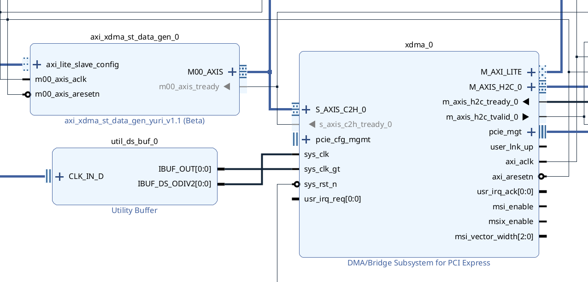
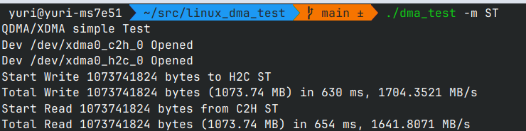

Xilinx XDMA-ST Demo Project
--------------------------------

Xilinx [XDMA IP](https://docs.amd.com/r/en-US/pg195-pcie-dma/Features) 를 사용한 PCIe 구현 데모를 목적으로 한 Project입니다. 

## FPGA
  
  
Vivado로 [tcl스크립트](4cg_xdma_st_with_bar.tcl) 실행해 프로젝트를 생성할 수 있습니다. 
* constraints 는 Puzhi ZU4EV-FL 보드 기준으로 만들어져 있습니다. 

## Linux
  
  
linux_dma_test 의 프로그램으로 간단한 대역폭 테스트와 Config BAR 테스트가 가능합니다.   
